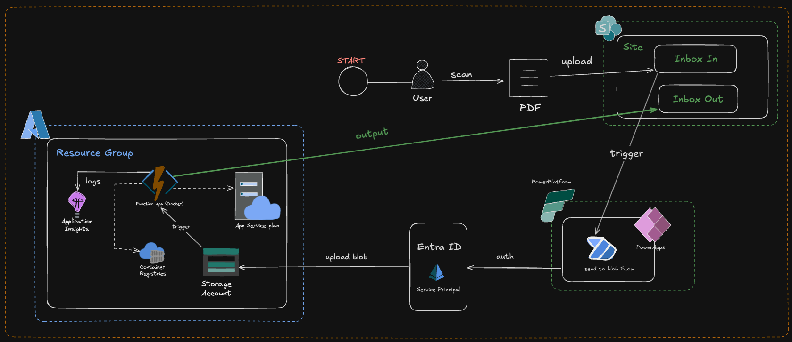

# PDF Splitter - Azure Function

A serverless Azure Function that automatically processes PDF documents by detecting divider pages and splitting them into separate documents. The split PDFs are then uploaded to SharePoint for organized document management.

## 🚀 Overview

This Azure Function monitors a blob storage container for uploaded PDF files and automatically:

1. **Detects divider pages** using text extraction or OCR (Optical Character Recognition)
2. **Splits PDFs** into separate documents based on divider locations
3. **Uploads split documents** to SharePoint with timestamped filenames
4. **Moves processed files** to a "processed" container for archival

## 🏗️ Architecture



```
PDF Upload → Blob Storage → Azure Function → PDF Processing → SharePoint Upload
                ↓
         Processed Container (Archive)
```

### Key Components

- **Blob Trigger**: Monitors `pdfs/` container for new PDF uploads
- **PDF Processing**: Hybrid approach using text extraction + OCR fallback
- **SharePoint Integration**: Certificate-based authentication for document upload
- **Error Handling**: Comprehensive logging and exception management

## 📋 Features

### ✨ Smart Divider Detection

- **Fast Path**: Text-based divider detection for searchable PDFs
- **Fallback Path**: OCR-based detection for image-based or scanned PDFs
- **Parallel Processing**: Multi-threaded OCR for improved performance

### 🔒 Secure SharePoint Integration

- Certificate-based authentication with Azure AD
- Automatic file uploads with timestamp-based naming
- Connection testing and error recovery

### 📊 Comprehensive Logging

- Detailed execution tracking
- Error reporting with stack traces
- Performance monitoring

### 🐳 Container Ready

- Docker support for consistent deployments
- Multi-language OCR support (German, English, French, Italian)
- Optimized for Azure Functions runtime

## ✅ Deployment Checklist

Before running the deployment scripts, ensure you have:

- [ ] Azure CLI installed and authenticated (`az login`)
- [ ] Docker installed (for containerized deployment)
- [ ] Proper Azure subscription permissions (Contributor role minimum)
- [ ] Unique resource names configured in `deploy.sh`
- [ ] Certificate files generated and placed in `certs/` directory
- [ ] `settings.json` file created with all required environment variables
- [ ] SharePoint site and document library accessible
- [ ] Azure AD app registration permissions configured

### Quick Start Commands

```bash
# 1. Clone and navigate to project
git clone <repository-url>
cd vgp-splitpdfs

# 2. Configure deployment variables
nano deploy.sh  # Edit resource names and location

# 3. Run infrastructure deployment
chmod +x deploy.sh && ./deploy.sh

# 4. Create settings.json with your environment variables
nano settings.json

# 5. Apply application settings
chmod +x app_settings.sh && ./app_settings.sh

# 6. Upload certificate to Azure AD app registration (manual step)
# 7. Test with a sample PDF upload
```

## 🛠️ Setup & Installation

### Prerequisites

- Azure Subscription with:
  - Azure Functions App
  - Azure Storage Account (2 containers: `pdfs`, `processed-pdfs`)
  - Application registration with certificate authentication
- SharePoint site with document library access
- Docker (for containerized deployment)

### 1. Environment Configuration

Create a `.env` file or configure Application Settings:

```env
# Azure AD Configuration
TENANT_NAME=your-tenant.onmicrosoft.com
TENANT_ID=your-tenant-id
CLIENT_ID=your-app-registration-id
CLIENT_SECRET=your-client-secret

# SharePoint Configuration
SHAREPOINT_SITE_URL=https://yourtenant.sharepoint.com/sites/yoursite
SHAREPOINT_SITE_NAME=YourSiteName
SHAREPOINT_DOC_LIBRARY=/sites/yoursite/Shared Documents

# Storage Account Configuration
SA_URL=https://yourstorageaccount.blob.core.windows.net
SA_NAME=yourstorageaccount
SA_CONTAINER_NAME_PDFS=pdfs
SA_CONTAINER_NAME_PROCESSED_PDFS=processed-pdfs
SA_CONN_STR=DefaultEndpointsProtocol=https;AccountName=...

# Certificate Configuration
CERTIFICATE_PATH=certs/split-pdfs.pem
THUMBPRINT=your-certificate-thumbprint

# Processing Configuration
DIVIDER_TEXT=DIVIDER_PAGE_TEXT
```

### 2. Certificate Setup

1. Generate a certificate for Azure AD app registration:

```bash
openssl req -x509 -newkey rsa:2048 -keyout split-pdfs.key -out split-pdfs.cer -days 365 -nodes
openssl pkcs12 -export -out split-pdfs.pfx -inkey split-pdfs.key -in split-pdfs.cer
openssl x509 -inform DER -in split-pdfs.cer -out split-pdfs.pem
```

2. Upload the `.cer` file to your Azure AD app registration
3. Place certificate files in the `certs/` directory

## 3. Automated Deployment with Scripts

This project includes automated deployment scripts that handle the complete Azure infrastructure setup and application deployment.

#### Step 1: Configure Deployment Variables

Edit the `deploy.sh` script to match your environment:

```bash
RESOURCE_GROUP="prod-01-appl-splitpdfs"
ACR_NAME="vgpsplitpdfsacr"
FUNCTION_APP_NAME="splitpdfs-fapp-cont"
STORAGE_ACCOUNT="splitpdfsa"
APP_SERVICE_PLAN="splitpdfs-asp"
LOCATION="switzerlandnorth"
CLIENT_NAME="splitpdfs-client"
```

#### Step 2: Run Complete Infrastructure Deployment

Execute the deployment script to create all Azure resources:

```bash
chmod +x deploy.sh
./deploy.sh
```

**What the deployment script does:**

1. **Azure Login & Resource Group Creation**

   ```bash
   az login
   az group create --name $RESOURCE_GROUP --location "$LOCATION"
   ```

2. **Role Assignment Setup**

   - Assigns Contributor role to current user
   - Creates Azure AD application for SharePoint authentication
   - Assigns Storage Blob Data Contributor role to the AD app

3. **Container Registry Setup**

   ```bash
   az acr create --resource-group $RESOURCE_GROUP --name $ACR_NAME --sku Basic
   az acr build --registry $ACR_NAME --image pdf-splitting-function:latest
   ```

4. **Storage Account & Containers**

   - Creates storage account with Standard_LRS SKU
   - Creates `pdfs` container (for incoming PDFs)
   - Creates `processed-pdfs` container (for processed files)

5. **App Service Plan & Function App**

   ```bash
   az appservice plan create --name $APP_SERVICE_PLAN --sku P1V2 --is-linux
   az functionapp create --image $ACR_LOGIN_SERVER/pdf-splitting-function:latest
   ```

6. **Managed Identity Configuration**
   - Assigns system-assigned managed identity to Function App
   - Grants Storage Blob Data Contributor role to the managed identity

#### Step 3: Configure Application Settings

After successful deployment, configure the Function App settings using the `app_settings.sh` script:

1. **Create settings.json file** with your environment variables:

   ```json
   [
     {
       "name": "TENANT_NAME",
       "value": "your-tenant.onmicrosoft.com"
     },
     {
       "name": "TENANT_ID",
       "value": "your-tenant-id"
     },
     {
       "name": "CLIENT_ID",
       "value": "your-app-registration-id"
     },
     {
       "name": "SHAREPOINT_SITE_URL",
       "value": "https://yourtenant.sharepoint.com/sites/yoursite"
     },
     {
       "name": "SHAREPOINT_DOC_LIBRARY",
       "value": "/sites/yoursite/Shared Documents"
     },
     {
       "name": "SA_URL",
       "value": "https://yourstorageaccount.blob.core.windows.net"
     },
     {
       "name": "SA_CONTAINER_NAME_PDFS",
       "value": "pdfs"
     },
     {
       "name": "SA_CONTAINER_NAME_PROCESSED_PDFS",
       "value": "processed-pdfs"
     },
     {
       "name": "DIVIDER_TEXT",
       "value": "YOUR_DIVIDER_TEXT"
     }
   ]
   ```

2. **Execute the app settings script**:
   ```bash
   chmod +x app_settings.sh
   ./app_settings.sh
   ```

**What the app settings script does:**

1. **Applies Configuration**: Loads settings from `settings.json` to Function App

   ```bash
   az functionapp config appsettings set --name $FUNCTION_APP_NAME \
     -g $RESOURCE_GROUP --settings @settings.json
   ```

2. **Restarts Function App**: Ensures new settings take effect

   ```bash
   az functionapp restart --name $FUNCTION_APP_NAME --resource-group $RESOURCE_GROUP
   ```

3. **Verifies Deployment**: Checks Function App state
   ```bash
   az functionapp show --name $FUNCTION_APP_NAME --query state
   ```

#### Step 4: Post-Deployment Configuration

After running both scripts, complete these manual steps:

1. **Upload Certificate to Azure AD App Registration**:

   - Navigate to Azure Portal → Azure Active Directory → App registrations
   - Select your app (`splitpdfs-client`)
   - Go to Certificates & secrets → Upload certificate
   - Upload the `split-pdfs.cer` file

2. **Configure SharePoint Permissions**:

   - Grant necessary permissions to the Azure AD application
   - Ensure the app has access to your SharePoint site and document library

3. **Test the Function**:
   - Upload a test PDF to the `pdfs` container
   - Monitor Function logs for successful processing
   - Verify split PDFs appear in SharePoint document library

#### Alternative: Manual Deployment Options

If you prefer manual deployment:

**Option A: Docker Build & Push**

```bash
# Build the container locally
docker build -t vgp-splitpdfs .

# Tag and push to your registry
docker tag vgp-splitpdfs your-registry.azurecr.io/vgp-splitpdfs:latest
docker push your-registry.azurecr.io/vgp-splitpdfs:latest
```

**Option B: Direct Code Deployment**

```bash
# Install dependencies locally
pip install -r requirements.txt

# Deploy using Azure Functions Core Tools
func azure functionapp publish your-function-app-name --build remote
```

## 📁 Project Structure

```
vgp-splitpdfs/
├── function_app.py              # Main Azure Function app entry point
├── host.json                    # Function app configuration
├── requirements.txt             # Python dependencies
├── Dockerfile                   # Container configuration
├── deploy.sh                    # Deployment script
├── app_settings.sh             # Environment setup script
├── blob_trigger/
│   └── process_pdf.py          # Core PDF processing logic
├── shared/
│   ├── config/
│   │   └── env_config.py       # Environment configuration
│   └── o365_sharepoint/
│       └── upload_sp.py        # SharePoint upload utilities
└── certs/                      # Certificate files
    ├── split-pdfs.cer
    ├── split-pdfs.pem
    └── split-pdfs.pfx
```

## 🔧 Configuration

### Divider Text Configuration

Set the `DIVIDER_TEXT` environment variable to specify what text identifies divider pages:

```env
DIVIDER_TEXT="--- DIVIDER ---"
```

### OCR Language Support

The Docker container includes support for:

- German (`deu`)
- English (`eng`)
- French (`fra`)
- Italian (`ita`)

Add additional languages by modifying the Dockerfile:

```dockerfile
RUN apt-get install -y tesseract-ocr-spa  # Spanish support
```

## 🚀 Usage

1. **Upload PDF**: Place PDF files in the `pdfs/` blob container
2. **Automatic Processing**: Function triggers automatically on blob upload
3. **Monitor Logs**: Check Azure Function logs for processing status
4. **Retrieve Results**: Split PDFs appear in SharePoint document library
5. **Archive**: Original PDFs move to `processed-pdfs/` container

### Example Output Filenames

```
original-document_doc_1_05082025_143022.pdf
original-document_doc_2_05082025_143022.pdf
original-document_doc_3_05082025_143022.pdf
```

## 📊 Monitoring & Troubleshooting

### Log Analysis

Monitor Function execution through:

- Azure Portal → Function App → Functions → Monitor
- Application Insights (if configured)
- Live Log Stream

### Common Issues

**SharePoint Upload Failures**

- Verify certificate thumbprint matches
- Check SharePoint permissions
- Validate site URL and library path

**Memory Issues with Large PDFs**

- Implement streaming for large files
- Add memory monitoring
- Consider chunked processing

## 🔒 Security Considerations

- **Certificate Security**: Store certificates securely in Azure Key Vault
- **Access Control**: Use managed identities where possible
- **Network Security**: Consider VNet integration for enhanced security
- **Data Privacy**: Ensure compliance with data protection regulations

## 🤝 Contributing

1. Fork the repository
2. Create a feature branch (`git checkout -b feature/amazing-feature`)
3. Commit your changes (`git commit -m 'Add amazing feature'`)
4. Push to the branch (`git push origin feature/amazing-feature`)
5. Open a Pull Request

## 📄 License

This project is licensed under the MIT License - see the [LICENSE](LICENSE) file for details.

## 🏢 About Vision&

Developed by [visionand AG](https://visionand.ch) - Empowering businesses through intelligent document automation solutions.

---

**Last Updated**: August 2025  
**Version**: 1.0.0
